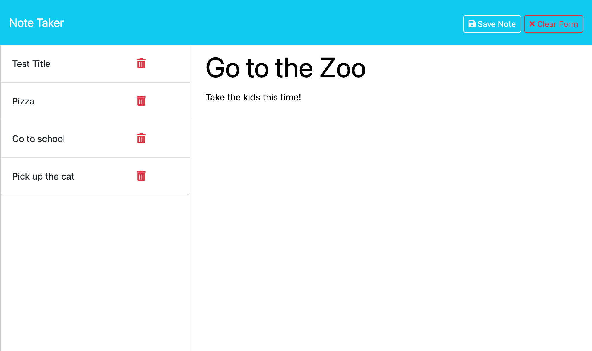

# Notetaker with Express

  ## Description
  
    
  This assignment was designed to modify starter code to create an application called Note Taker that can be used to write and save notes. This application will use an Express.js back end and will save and retrieve note data from a JSON file. 

  The application’s front end has already been created and I worked to create the back end, connect the two, and then deployed the entire application to Heroku. 

 
  

----------------------

  ## Table of Contents 
  
  - [Description](#description)
  - [Installation](#installation)
  - [Usage](#usage)
  - [Credits](#credits)
  - [License](#license)
  - [Tests](#tests)
  - [Contributing](#contributing)
  - [Questions](#questions)

---------------------- 

  ## Installation

  If you would like to use this application, you will need to make sure to have all dependencies in the package.json installed.  You will also need to load the application on localhost:3001.  To do so, in your terminal after opening the file, run npm start.  Then head over to the browser and go to localhost:3001.
  
  
----------------------

  ## Usage
  This project can be used to create daily and weekly notes and todos. 
  
  Website: N/A

----------------------

  ## Credits
  
  I referred to the mini project and other activities in Module 11 of the Bootcamp. I also used BCS for advice.
  

----------------------

  ## License
  
  This project is licensed under the terms of the MIT license.  Click the badge at the top of the README to get more information about the license.
  

----------------------

  ## Tests
  
  N/A
  

----------------------

  ## Contributing
  
  I have started to code out how to delete entries, but it still needs some work.  To contribute, clone the repo and commit any changes after review.
  
-----------------------

  ## Questions

  Name: Pamela Agrast 
  Repository: https://github.com/agrastp/Notetaker-Express/tree/main 
  Clone: git@github.com:agrastp/Notetaker-Express.git 
  E-mail: agrastp@yahoo.com
  
  
